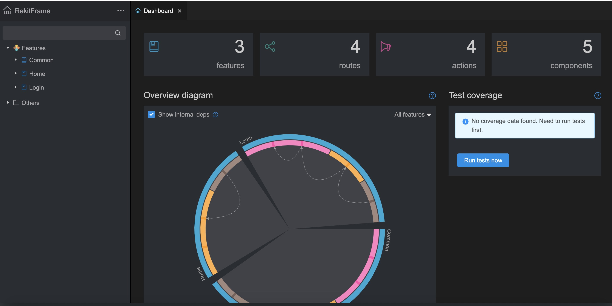
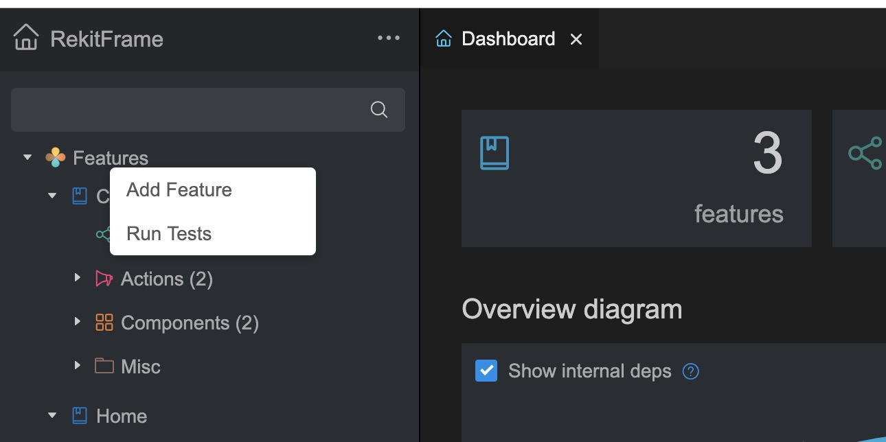
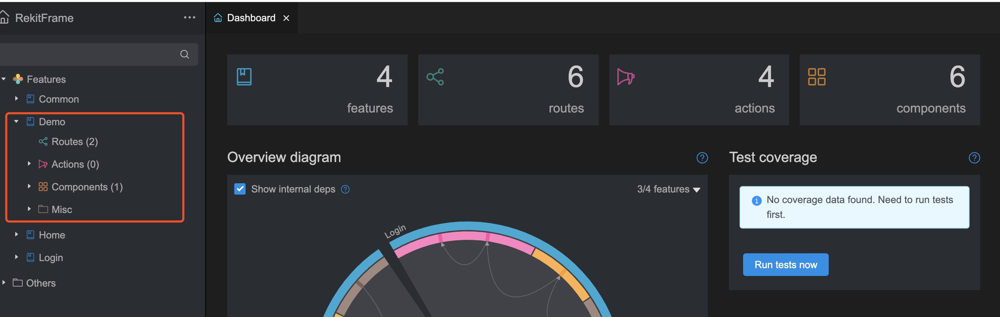
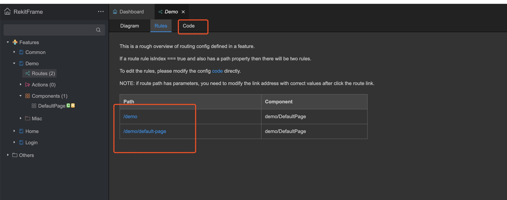
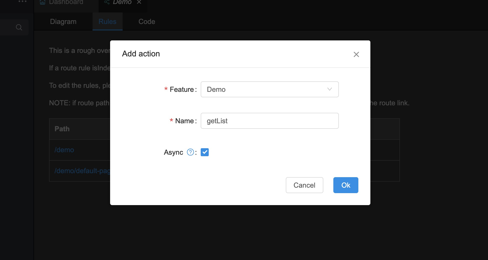
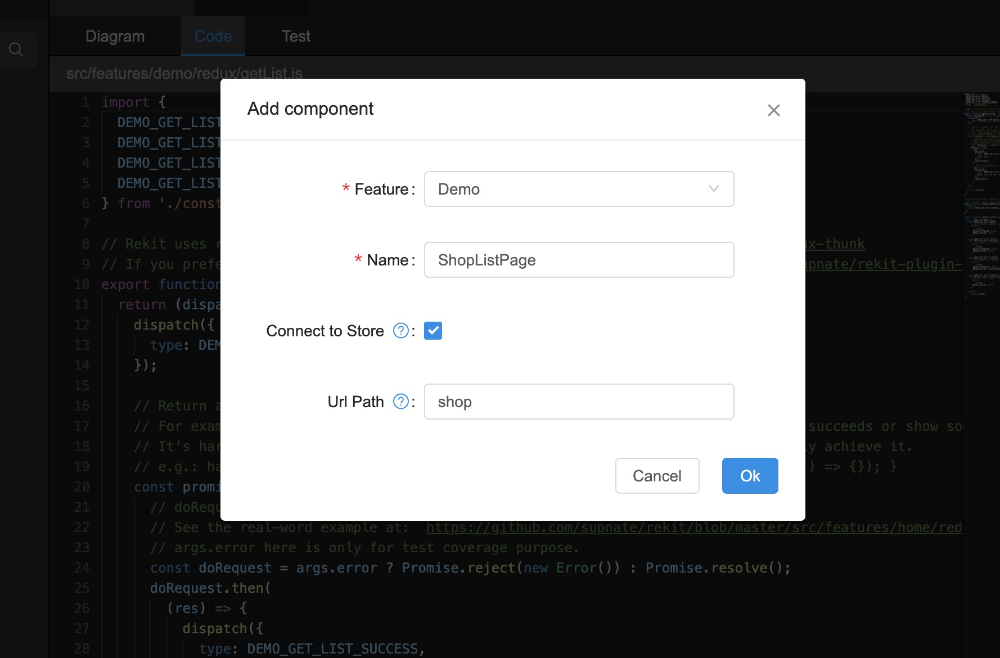
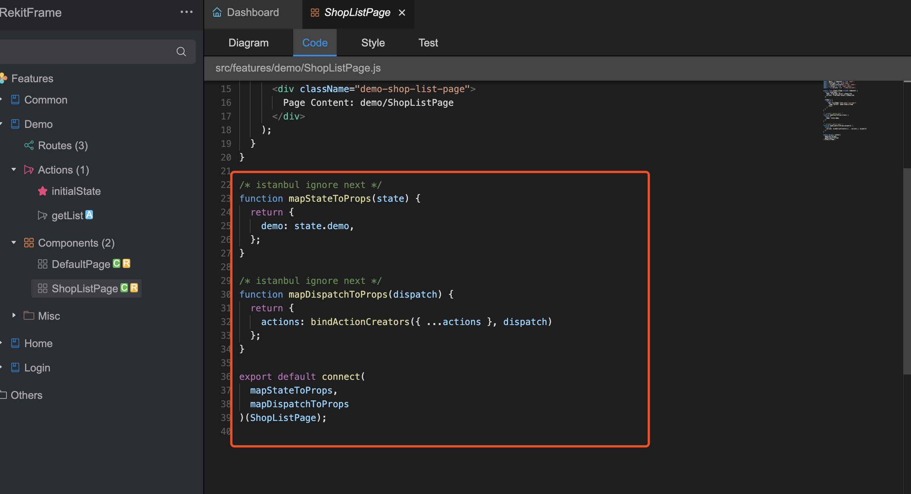

# REKIT 使用

项目启动后，访问 6076 端口 启动rekit 编辑器

## 项目目录结构

rekit首页打开如上图，会有一个基本的统计

* features 功能模块，对照领域模型，可以是一个特性组合，可以就是一个增删改查，比如，我做一个店铺管理，可以把店铺管理相关的东西都放在这个下面，比如，店铺管理员管理，店铺配置等。因为他们属于一个领域模型里。此处是个人见解，也可以进行模块细分，把店铺管理员再分一个features。
* routes 项目用到的路由
* actions redux 中用到的action
* components 组件 ，此处的组件，只是统计的所有features里的组件，外部组件不统计。

## 新增一个Feature

在features 目录右击创建

比如我现在要创建一个Demo，后续会以这个Demo features 来讲一个增删改查的案例

新增完后如下目录结构

如上：rekit 会自动创建完相关的文件以及目录

### Routes 
是这个Feature 里的路由，这套框架，会自动分离路由文件，也就是每个Feature 有独立的router进行管理，不会混淆。

访问 http://localhost:6075/demo 地址 可以直接访问到page

使用图形化工具可以直接看到相关路由，可以点击code进行路由的修改

### Actions

是redux 使用过程中的actions 模块

可以直接右击创建actions，actions分如下两种

* 普通action，比如改变基础状态，loading这些状态
* 异步action，一般用于请求后台数据，对应如下图，勾选Async即可

### Components

组件，一般Page结尾，就是跟路由绑定的也没，其他是普通的组件

#### 创建一个Component

创建页面时，一般会创建一个容器组件，即这个组件会帮的store的一个状态，需要配一个路由。如上。就可以直接创建出一个shopList的页面了。

创建完
http://localhost:6075/shop 访问地址就可以看到效果了

代码中可以直接看到store也绑定完毕。

如上编写相关代码时，可以看到，分层也比较清晰
Code 跟Style 已经分好。写在相应的tab下面即可。

