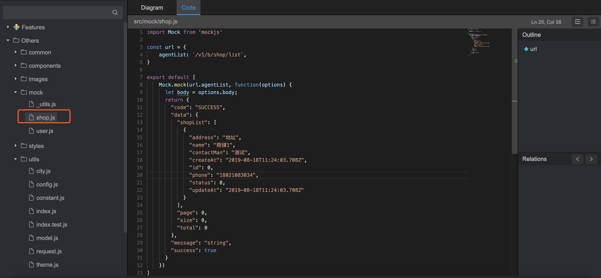
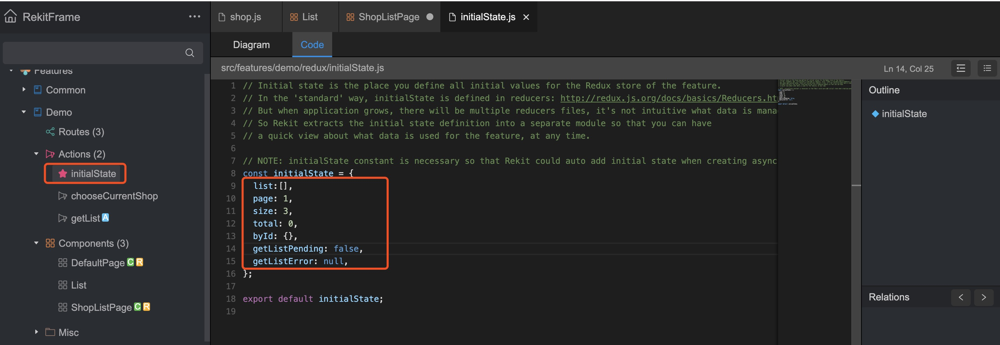

# 列表开发

## 新建一个mock请求列表



如上的接口请求，是模拟生产环境的接口请求，请求格式也可做为生产环境格式之用


## list 用到的基本状态


* list：此处只存id列表，为了扁平化处理
* page：当前页
* size：页数
* total：总数
* byId：通过id获取选项
* getListPending：加载状态
* getListError：出错日志

## 代码

### 新建list 组件

```
import React, { PureComponent } from 'react'
import PropTypes from 'prop-types'
import { Table, Modal, Avatar,Divider } from 'antd'
import moment from 'moment';

const { confirm } = Modal

class List extends PureComponent {
  handleMenuClick = (record, op) => {
    const { onDeleteItem, onEditItem } = this.props

    if (op === 1) {
      onEditItem(record)
    } else if (op === 2) {
      confirm({
        title: `确定要删除?`,
        onOk() {
          onDeleteItem(record.id)
        },
      })
    }
  }

  render() {
    const { onDeleteItem, onEditItem, ...tableProps, } = this.props

    const columns = [
      {
        title: "商户名",
        dataIndex: 'name',
        key: 'name',
        width: 180,
      },
      {
        title: "商户地址",
        dataIndex: 'address',
        key: 'address',
        width: 180,
      },
      {
        title: "联系人",
        dataIndex: 'contactMan',
        key: 'contactMan',
        width: 72,
      },
      {
        title: "创建时间",
        dataIndex: 'createAt',
        key: 'createAt',
        width: 72,
        render: text => <span>{moment(text).format("YYYY-MM-DD HH:mm:ss")}</span>,
      },
      {
        title: "状态",
        dataIndex: 'status',
        key: 'status',
        width: 72,
        render: text => <span>{text == 0 ? '关闭' : '开启'}</span>,
      },
      {
        title: '操作',
        key: 'action',
        width: 180,
        render: (text, record) => (
          <span>
            <a onClick = {(e) => this.handleMenuClick(record,1)}>修改</a>
            <Divider type="vertical" />
             <a onClick = {(e) => this.handleMenuClick(record,2)}>删除</a>
          </span>
        ),
      },
    ]

    return (
      <Table
        {...tableProps}
        pagination={{
          ...tableProps.pagination,
          showTotal: total => `共 ${total} 项`,
        }}
        bordered
        columns={columns}
        simple
        rowKey={record => record.id}
      />
    )
  }
}

List.propTypes = {
  onDeleteItem: PropTypes.func,
  onEditItem: PropTypes.func,
  location: PropTypes.object,
}

export default List

```

### 修改ShopListPage 组件

#### 新增list props

```
  getDataSource() {
    const { demo } = this.props;
    const { byId, list } = demo;
    if (!list) return [];
    return list.map(id => byId[id]);
  }

  get listProps() {
    const { demo,actions } = this.props
    const { getListPending,total } = demo
    const { deleteShop,chooseCurrentShop,shopModalChange } = actions;

    return {
      dataSource: this.getDataSource(),
      loading: getListPending,
      pagination:{
        total:agentTotal,
        onChange : (page) => {
          this.props.history.push(`/demo/list/${page}`)
        }
      },
      onDeleteItem: id => {
        deleteShop(id).then((data) => {
          this.fetchList();
        })
      },
      onEditItem(item) {
         chooseCurrentShop(item);
         shopModalChange(true,"updata");
      },
    }
  }  
```

### 请求

```
  componentDidMount(){
     const page = this.props.match.params.page || 1;
     this.fetchList(page);
  }

  fetchList = (page,name) => {
    const {getAgentList} = this.props.actions;
    getAgentList(page,name);
  }

  componentDidUpdate(prevProps) {
    const page = this.props.match.params.page || 1;
    const prevPage = prevProps.match.params.page || 1;
    if (prevPage !== page && !this.props.admin.getAgentListPending) {
      this.fetchList(page);
    }
  }
```

### 添加getList 的action

```
import {
  DEMO_GET_LIST_BEGIN,
  DEMO_GET_LIST_SUCCESS,
  DEMO_GET_LIST_FAILURE,
  DEMO_GET_LIST_DISMISS_ERROR,
} from './constants';

import '../../../mock/shop'
import request from '../../../utils/request'
// Rekit uses redux-thunk for async actions by default: https://github.com/gaearon/redux-thunk
// If you prefer redux-saga, you can use rekit-plugin-redux-saga: https://github.com/supnate/rekit-plugin-redux-saga
export function getList(page) {
  return (dispatch) => { // optionally you can have getState as the second argument
    dispatch({
      type: DEMO_GET_LIST_BEGIN,
    });

   const promise = new Promise((resolve, reject) => {
        request({
          method:'get',
          url:'/v1/b/shop/list',
        }).then( data => {
            dispatch({
                type: DEMO_GET_LIST_SUCCESS,
                data: data,
            });
            resolve(data);
        }).catch (error => {
            dispatch({
              type: DEMO_GET_LIST_FAILURE,
              data: { error: error },
            });
            reject(error);
        })
    });

    return promise;
  };
}

// Async action saves request error by default, this method is used to dismiss the error info.
// If you don't want errors to be saved in Redux store, just ignore this method.
export function dismissGetListError() {
  return {
    type: DEMO_GET_LIST_DISMISS_ERROR,
  };
}

export function reducer(state, action) {
  switch (action.type) {
    case DEMO_GET_LIST_BEGIN:
      // Just after a request is sent
      return {
        ...state,
        getListPending: true,
        getListError: null,
      };

    case DEMO_GET_LIST_SUCCESS:
      // The request is success

      const byId = {};
      const items = [];
      action.data.shopList.forEach(item => {
        items.push(item.id);
        byId[item.id] = item;
      });
      return {
        ...state,
        byId:byId,
        list:items,
        page: action.data.page,
        size: action.data.size,
        total: action.data.total,
        getListPending: false,
        getListError: null,
      };

    case DEMO_GET_LIST_FAILURE:
      // The request is failed
      return {
        ...state,
        getListPending: false,
        getListError: action.data.error,
      };

    case DEMO_GET_LIST_DISMISS_ERROR:
      // Dismiss the request failure error
      return {
        ...state,
        getListError: null,
      };

    default:
      return state;
  }
}

```

其中以下代码就是做了扁平化处理

```
      action.data.shopList.forEach(item => {
        items.push(item.id);
        byId[item.id] = item;
      });
```

### 添加删除action -- deleteShop

```
import {
  DEMO_DELETE_SHOP_BEGIN,
  DEMO_DELETE_SHOP_SUCCESS,
  DEMO_DELETE_SHOP_FAILURE,
  DEMO_DELETE_SHOP_DISMISS_ERROR,
} from './constants';

import '../../../mock/shop'
import request from '../../../utils/request'
// Rekit uses redux-thunk for async actions by default: https://github.com/gaearon/redux-thunk
// If you prefer redux-saga, you can use rekit-plugin-redux-saga: https://github.com/supnate/rekit-plugin-redux-saga
export function deleteShop(id) {
  return (dispatch) => { // optionally you can have getState as the second argument
    dispatch({
      type: DEMO_DELETE_SHOP_BEGIN,
    });

   const promise = new Promise((resolve, reject) => {
        request({
          method:'get',
          url:'/v1/b/shop/delete',
          data:{id:id}
        }).then( data => {
            dispatch({
                type: DEMO_DELETE_SHOP_SUCCESS,
            });
            resolve(data);
        }).catch (error => {
            dispatch({
              type: DEMO_DELETE_SHOP_FAILURE,
              data: { error: error },
            });
            reject(error);
        })
    });

    return promise;
  };
}

// Async action saves request error by default, this method is used to dismiss the error info.
// If you don't want errors to be saved in Redux store, just ignore this method.
export function dismissDeleteShopError() {
  return {
    type: DEMO_DELETE_SHOP_DISMISS_ERROR,
  };
}

export function reducer(state, action) {
  switch (action.type) {
    case DEMO_DELETE_SHOP_BEGIN:
      // Just after a request is sent
      return {
        ...state,
        deleteShopPending: true,
        deleteShopError: null,
      };

    case DEMO_DELETE_SHOP_SUCCESS:
      // The request is success
      return {
        ...state,
        deleteShopPending: false,
        deleteShopError: null,
      };

    case DEMO_DELETE_SHOP_FAILURE:
      // The request is failed
      return {
        ...state,
        deleteShopPending: false,
        deleteShopError: action.data.error,
      };

    case DEMO_DELETE_SHOP_DISMISS_ERROR:
      // Dismiss the request failure error
      return {
        ...state,
        deleteShopError: null,
      };

    default:
      return state;
  }
}

```

### render 引入

```
  render() {
    return (
      <div className="demo-shop-list-page">
        <List {...this.listProps} />
      </div>
    );
  }
```
