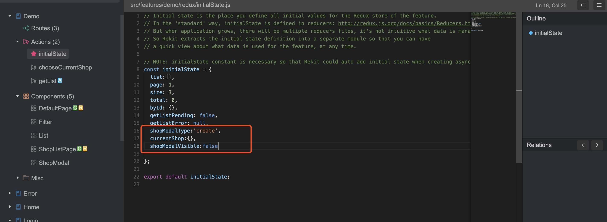
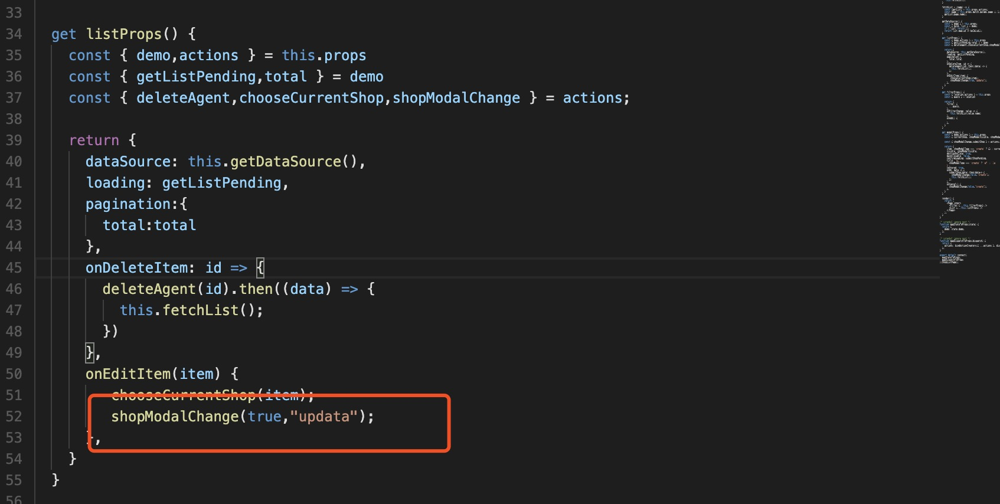
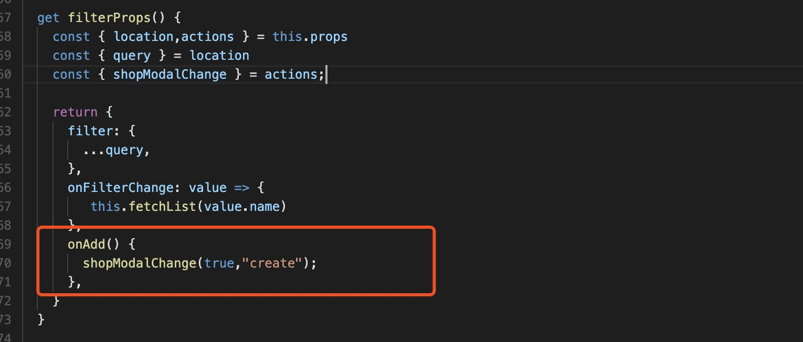

# 新增修改

## 新增ShopModal组件

```
import React, { Component } from 'react';
import PropTypes from 'prop-types'
import { Form, Input, InputNumber, Radio, Modal, Cascader } from 'antd'
import { FormBuilder } from '../../components'

const FormItem = Form.Item

const formItemLayout = {
  labelCol: {
    span: 6,
  },
  wrapperCol: {
    span: 14,
  },
}

class FormModal extends Component {
  static propTypes = {

  };

  handleOk = () => {
    const { item = {}, onOk, form } = this.props
    const { validateFields, getFieldsValue } = form

    validateFields(errors => {
      if (errors) {
        return
      }
      const data = {
        ...getFieldsValue(),
        id: item.id,
      }
      onOk(data)
    })
  }

  render() {
    const { item = {}, onOk, form, ...modalProps } = this.props

    const formMeta = {
      colon: true,
      columns: 1,
      formItemLayout: formItemLayout,
      elements: [
        {
          key: "name",
          label: "店铺名",
          initialValue: item.name,
          widget: Input,
          required: true
        },
        {
          key: "contactMan",
          label: "联系人",
          initialValue: item.contactMan,
          widget: Input,
          required: true
        },
        {
          key: "address",
          label: "联系地址",
          initialValue: item.address,
          widget: Input,
          required: true
        },
        {
          key: "phone",
          label: "联系电话",
          initialValue: item.phone,
          widget: Input,
          required: true
        },
        
      ]
    };

    return (
      <Modal {...modalProps} onOk={this.handleOk}>
        <Form layout="horizontal">
          <FormBuilder meta={formMeta} form={form} />
        </Form>
      </Modal>
    )
  }
}

const WrapperModal = Form.create({ name: 'shop_modal' })(FormModal);

export default WrapperModal;

```

## ShopListPage 中引入

### props 属性

```

get modalProps() {
    const { demo,actions } = this.props
    const { currentShop, shopModalVisible, shopModalType,submitShopPending } = demo

    const { shopModalChange,submitShop } = actions;

    return {
      item: shopModalType === 'create' ? {} : currentShop,
      visible: shopModalVisible,
      destroyOnClose: true,
      maskClosable: false,
      confirmLoading: submitShopPending,
      title: `${
        shopModalType === 'create' ? `创建` : `更新`
      }`,
      centered: true,
      onOk: data => {
        submitShop(data).then(data=> {
          shopModalChange(false,"create");
          this.fetchList();
        })
      },
      onCancel() {
        shopModalChange(false,"create");
      },
    }
  }
  
```

### 添加3个状态



### 添加显示隐藏modal的action -- shopModalChange

```
import {
  DEMO_SHOP_MODAL_CHANGE,
} from './constants';

export function shopModalChange(visible,type) {
  return {
    type: DEMO_SHOP_MODAL_CHANGE,
    data: {visible,type},
  };
}

export function reducer(state, action) {
  switch (action.type) {
    case DEMO_SHOP_MODAL_CHANGE:
      return {
        ...state,
        shopModalType:action.data.type,
        shopModalVisible:action.data.visible
      };

    default:
      return state;
  }
}
```

### 选择当前的 shop action

```
import {
  DEMO_CHOOSE_CURRENT_SHOP,
} from './constants';

export function chooseCurrentShop(shop) {
  return {
    type: DEMO_CHOOSE_CURRENT_SHOP,
    data: shop
  };
}

export function reducer(state, action) {
  switch (action.type) {
    case DEMO_CHOOSE_CURRENT_SHOP:
      return {
        ...state,
        currentShop:action.data,
      };

    default:
      return state;
  }
}

```

### submit action -- submitShop

```
import {
  DEMO_SUBMIT_SHOP_BEGIN,
  DEMO_SUBMIT_SHOP_SUCCESS,
  DEMO_SUBMIT_SHOP_FAILURE,
  DEMO_SUBMIT_SHOP_DISMISS_ERROR,
} from './constants';

import '../../../mock/shop'
import request from '../../../utils/request'

// Rekit uses redux-thunk for async actions by default: https://github.com/gaearon/redux-thunk
// If you prefer redux-saga, you can use rekit-plugin-redux-saga: https://github.com/supnate/rekit-plugin-redux-saga
export function submitShop(params) {
  return (dispatch) => { // optionally you can have getState as the second argument
    dispatch({
      type: DEMO_SUBMIT_SHOP_BEGIN,
    });

    let apiurl = '/v1/b/shop/add';

    console.log(params);
    
    if (params.id != undefined){
      apiurl = '/v1/b/shop/update';
    }

    const promise = new Promise((resolve, reject) => {
        request({
          method:'get',
          url:apiurl,
          data: params,
        }).then( data => {
            dispatch({
                type: DEMO_SUBMIT_SHOP_SUCCESS,
                data: data,
            });
            resolve(data);
        }).catch (error => {
            dispatch({
              type: DEMO_SUBMIT_SHOP_FAILURE,
              data: { error: error },
            });
            reject(error);
        })
    });

    return promise;
  };
}

// Async action saves request error by default, this method is used to dismiss the error info.
// If you don't want errors to be saved in Redux store, just ignore this method.
export function dismissSubmitShopError() {
  return {
    type: DEMO_SUBMIT_SHOP_DISMISS_ERROR,
  };
}

export function reducer(state, action) {
  switch (action.type) {
    case DEMO_SUBMIT_SHOP_BEGIN:
      // Just after a request is sent
      return {
        ...state,
        submitShopPending: true,
        submitShopError: null,
      };

    case DEMO_SUBMIT_SHOP_SUCCESS:
      // The request is success
      return {
        ...state,
        submitShopPending: false,
        submitShopError: null,
      };

    case DEMO_SUBMIT_SHOP_FAILURE:
      // The request is failed
      return {
        ...state,
        submitShopPending: false,
        submitShopError: action.data.error,
      };

    case DEMO_SUBMIT_SHOP_DISMISS_ERROR:
      // Dismiss the request failure error
      return {
        ...state,
        submitShopError: null,
      };

    default:
      return state;
  }
}


```

### list 属性中 编辑事件中添加 action



### filter 属性中 新增事件中添加 action




### render 引入组件

```
<ShopModal {...this.modalProps} />

```


