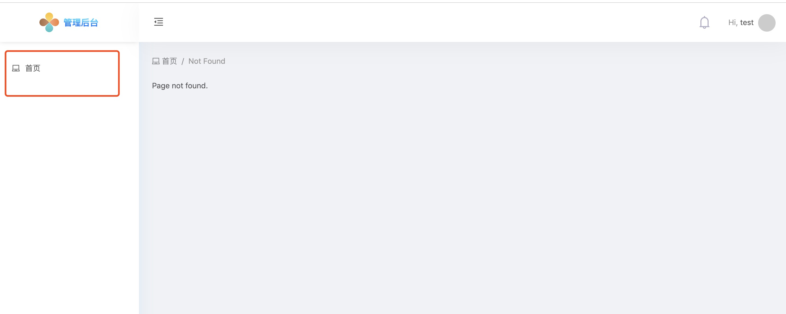
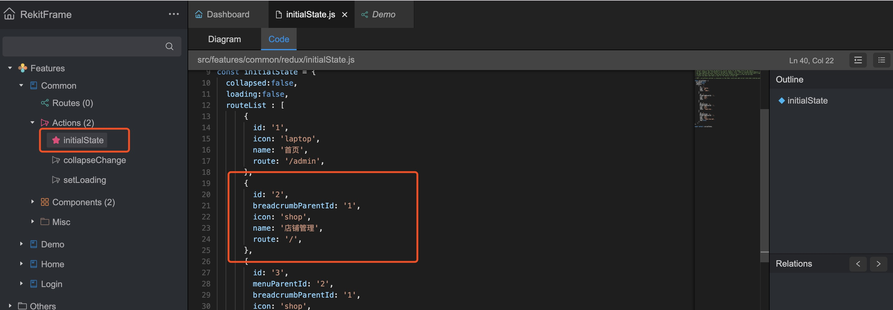
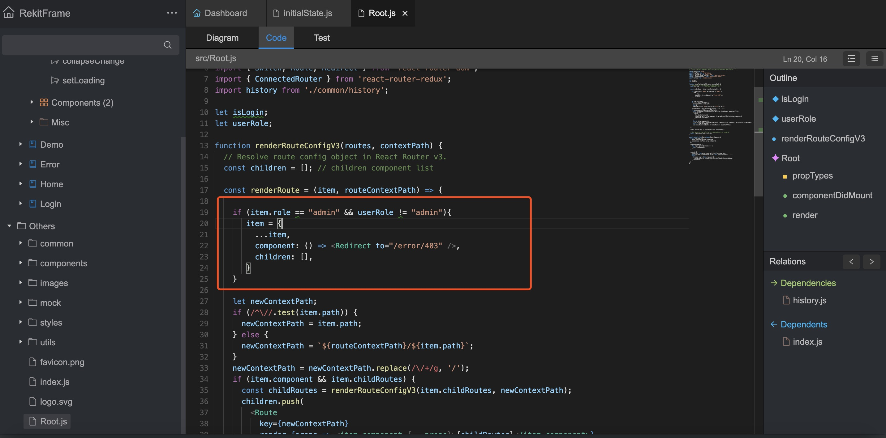
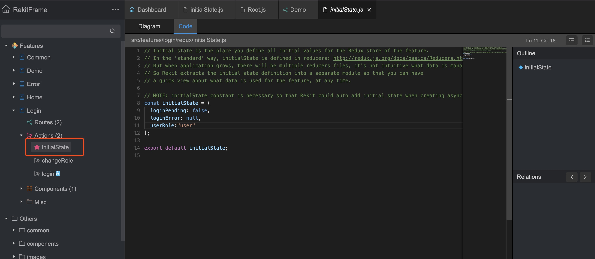

# 框架基础

项目启动后，访问 6076 端口 启动rekit 编辑器

## 配置菜单

使用Rekit 创建完相关page后，想把路由添加到左边的菜单中，需要在Common feature 中去添加

如上图，在common的初始化状态中添加菜单的路由。

### 菜单的参数

* id： 菜单id
* icon： 菜单图标
* name： 菜单名
* route：路由地址
* menuParentId：上级菜单id
* breadcrumbParentId：上级面包屑的菜单ID
* show：是否显示，有些菜单，比如add，是不需要显示的，但他需要通过breadcrumbParentId 的配置回到上级列表，这个也能配到菜单里。

## 路由配置来处理权限

框架在Root.js 里做了权限的拦截。此处的意思是
如果路由需要，admin这个权限，但用户不是admin，直接重定向到403页面。

下面我们看下具体配置。
### 先在路由上加配置拦截
就以shoplist的路由为例

这样我们就给shop的路由配置必须是admin权限才能访问

### 具体是读哪个状态呢？

是login下的状态。
目前是user ，我们访问
http://localhost:6075/demo/shop 

会发现重定向到了 http://localhost:6075/error/403 地址

只要把user 改成admin 就可以访问了，这是权限的拦截，生产中，一般是登录页登录成功，把这个状态通过redux 改成想要的权限即可。为了下面的章节演示，我们把权限改成admin
